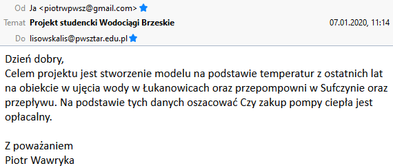
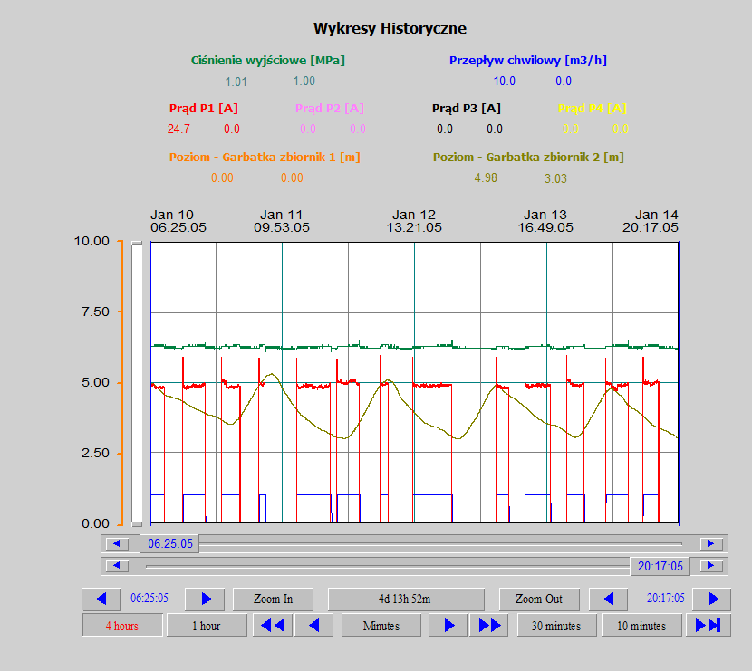
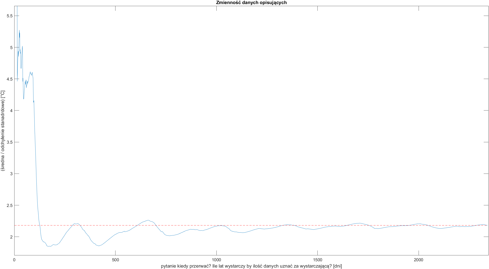

# Projekt [#Wodociągi 2020](https://matlab.mathworks.com/users/mwa0000016477570/Published/Wod20/mean/html/comparison2mean.html#2)

[Wybrana pompa](pump.md)

#### Abstract



### Poziom wody w zbiorniku na garbatce


## Prezentacja danych ToDo

### Eliminacja zmiennych quasi-losowych [[1]](#1)


> Ostatnie 365 dni ma zmienność bliską do wyniku z ostatniego dnia do setnej części po przecinku.
```matlab
quasiZmiennosc7lat =

   -0.0119


quasiZmiennosc3lat =

    0.3894

```
>Wniosek: 
> Do dobrego modelu wystarczyłyby 3 lata zbierania temperatur

### Model ToDo

 ## References
<a id="1">[1]</a> 
Nowak, Edward (1951- ).
Zarys metod ekonometrii : zbiór zadań<br>
Wyd. 3 popr. - Warszawa : Wydaw. Naukowe PWN, 2002. - 222, [2]

Co robi woda we Wszechświecie? Łukasz Lamża 
https://www.youtube.com/watch?v=NKEYlT7iFAY


##### ToDo: 
- modelowanie cieczy pośredniczącej
