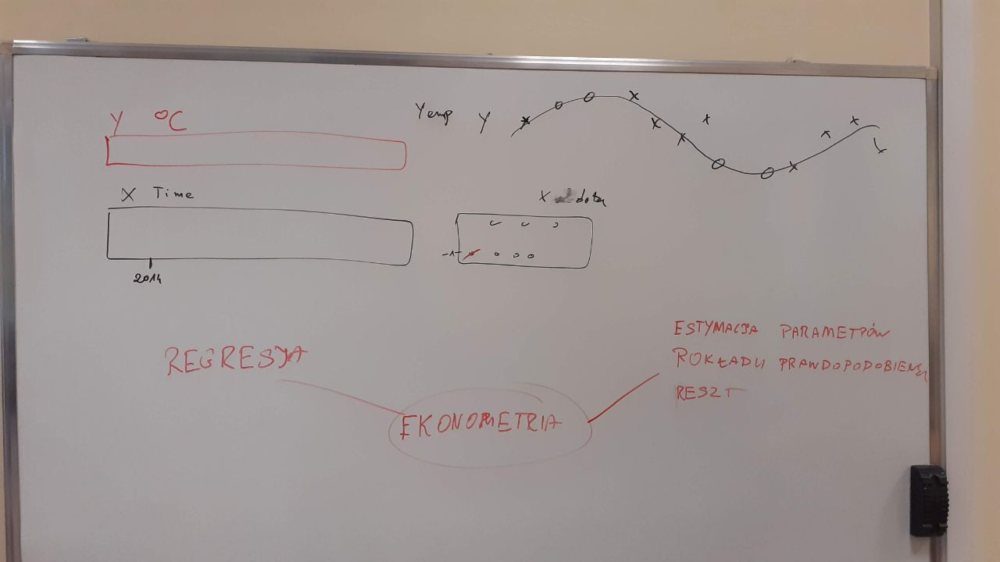
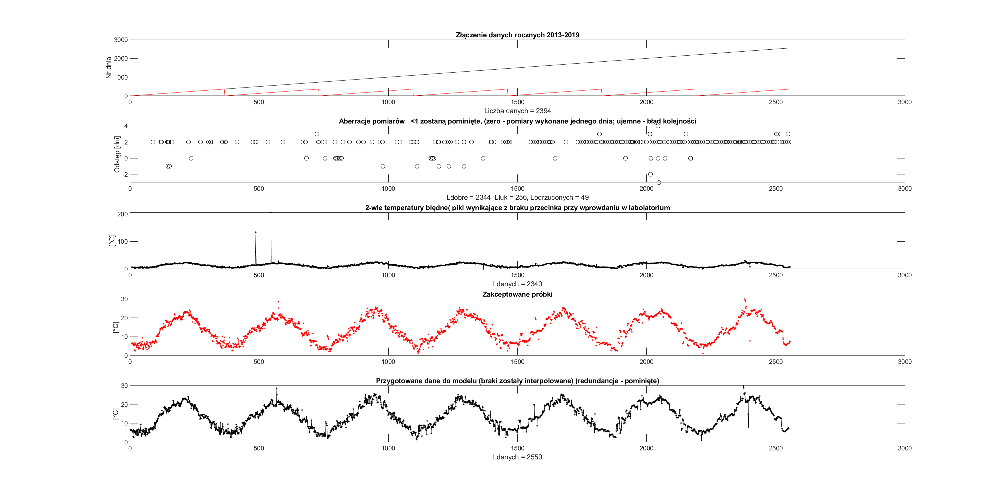
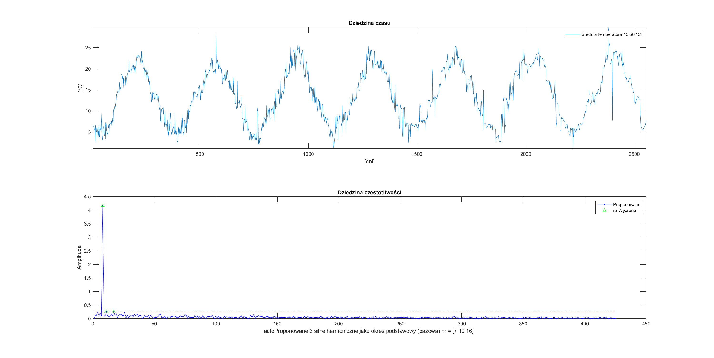
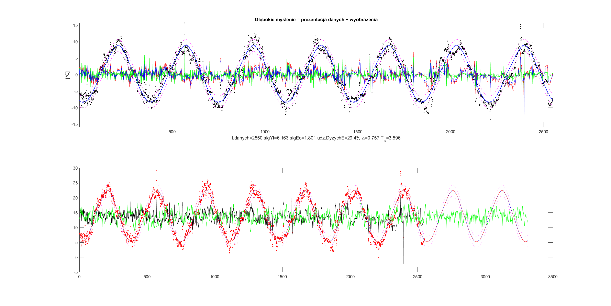

Publikacja nieoficjalna 

# Projekt [#Wodociągi 2020](https://matlab.mathworks.com/users/mwa0000016477570/Published/Wod20/mean/html/comparison2mean.html#2)

* [Wstęp](#wstęp)  
* [Instrukcja](#instrukcja)  
* [Proces modelowania](#proces-modelowania)

#### Wstęp 

Cecha wyróżniająca poniżej zaprezentowane podejście do modelowania ma na ceu edukacyjny charakter projektowania eksperckigo. Jest to przetarcie szlaku pomiędzy ludźmi, gdzie kontakt, który z punktu widzenia projektu co do formy nie jest przedmiotem rzeczy. Istotą jest budowa pomostu pomiędzy odmienną perspektywą.

__Informatyk* -> Narzędzie komunikacji <- __Ekspert dziedzinowy__

> przyp. autora: nie bez powodu tak zapisuję słowa używanie przez 2 strony współpracy. Najczęściej sytuacja wymaga zanegowania rzeczywistości, by informatyk * "był w kropce", a ekspert dziedzinowy miał proste "podstawy" __ do wytycznia kierunku rozwoju.

Takie podejście nie wyklucza to metod neuronowych na etapie początkowym, jednakże docelowo Model Matematyczny ma zostać opisany językiem wykluczającym dwuznaczności w dziedzinie sterowania.

> ### Init - pierwszy mail
>
> 

### Instrukcja

Jest to możliwie najprostszy przykład akademickiego podejścia, by nie odstraszać potencjalnych zainteresowanych praktyków.

Zamiast dopasowania wielomianu, użyty został model rozwinięcia szereg Furerowski, czyli założenie o niezależności czasowej.

Dane wejściowe to 2 wetory pomiaru:
* __Temperatury__ z Stacji Uzdatniania Wody w Łukanowicach
* __Czasu__ z numerem dnia pobrania próbki w cyklu rocznym

Przygotowanie danych obejmuje uśrednienie pomiarów nadpróbkowanych (dziennych) oraz interpolację pustych węzłów cyklu. (bez milenijnego)

## Proces modelowania
> Koncept
> 
> 

> Przygotowanie zebranych danych empirycznych
> 
> 

> Prezentacja
> 
> 
> Prognoza temperatur na 2 przyszłe lata. Z dokładnością do 3 dni w przód (*T alpha*) na podstawie historii, zaniku stałej czasowej
> 
> 


### Dalsza część instrukcji wykracza poza podstawowy zakres materiału, czytelnik czyta na własną odpowiedzialność :wink:


### Poziom wody w zbiorniku na garbatce
Dane z rozpoznania obiektu fizycznego


### Eliminacja  quasi-zmienności [[1]](#1)
> porządane serie wartości powyżej przerywanej
> ToDo okno ruchome 1 roku( które lata najbardziej odstają)


> Ostatnie 365 dni ma zmienność bliską do wyniku z ostatniego dnia do setnej części po przecinku.
```matlab
quasiZmiennosc7lat =

   -0.0119


quasiZmiennosc3lat =

    0.3894

```
> Wniosek: 
> 
> Do dobrego modelu wystarczyłyby 3 lata zbierania temperatur, z dokładnością do 0.3894 *C.


 ## References
<a id="1">[1]</a> 
Nowak, Edward (1951- ).
Zarys metod ekonometrii : zbiór zadań<br>
Wyd. 3 popr. - Warszawa : Wydaw. Naukowe PWN, 2002. - 222, [2]

https://www.youtube.com/watch?v=NKEYlT7iFAY
Co robi woda we Wszechświecie? Łukasz Lamża 

Fizyka chmur - Prof. Wojciech Grabowski
https://zapytajfizyka.fuw.edu.pl/wyklady/wojciech-grabowski/

##### ToDo: 
- [modelowanie cieczy pośredniczącej](modelowanie cieczy pośredniczącej)

piotrwpwsz@gmail.com

### choice of pump

Signal.md analise
Object.md this file
Model.md matlab