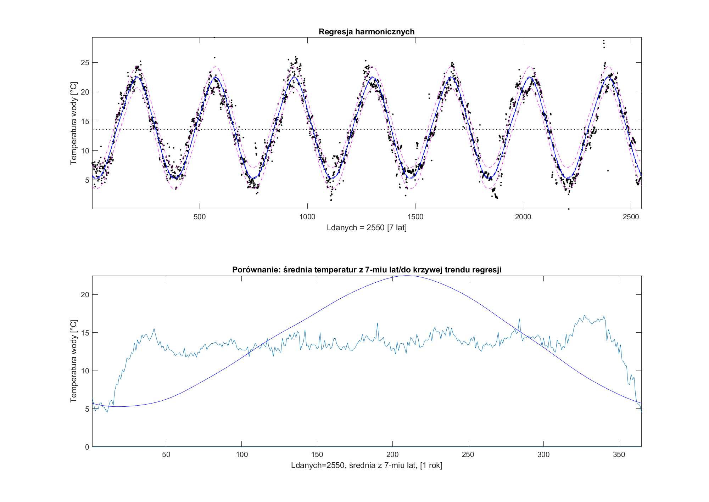

Publikacja nieoficjalna EAP piotrwpwsz@gmail.com

# Projekt [#Wodociągi 2020](https://matlab.mathworks.com/users/mwa0000016477570/Published/Wod20/mean/html/comparison2mean.html#2)

* [Wstęp](#wstęp)  
* [Instrukcja](#instrukcja)  
* [Proces modelowania](#proces-modelowania)

#### Wstęp 

Cecha wyróżniająca poniżej zaprezentowane podejście do modelowania ma na celu edukacyjny charakter projektowania eksperckigo. Jest to przetarcie szlaku pomiędzy ludźmi, gdzie kontakt, który z punktu widzenia projektu co do formy nie jest przedmiotem rzeczy. Istotą jest budowa pomostu pomiędzy odmienną perspektywą.

_ __Informatyk__ -> Narzędzie komunikacji <- *Ekspert dziedzinowy*

> przyp. autora: nie bez powodu tak zapisuję słowa używanie przez 2 strony współpracy. Najczęściej sytuacja wymaga zanegowania rzeczywistości, by informatyk * "był w kropce", a ekspert dziedzinowy miał proste "podstawy" __ do wytycznia kierunku rozwoju.

Takie podejście nie wyklucza to metod neuronowych na etapie początkowym, jednakże docelowo Model Matematyczny ma zostać opisany językiem wykluczającym dwuznaczności w dziedzinie sterowania.

> ### Init - pierwszy mail
>
> 

### Instrukcja

Jest to możliwie jeden z najprostszych przykładów akademickiego podejścia, by nie odstraszać potencjalnych zainteresowanych praktyków.

Zamiast dopasowania wielomianu, użyty został model rozwinięcia szereg Furerowski, czyli założenie o niezależności czasowej.

Dane wejściowe to 2 wetory pomiaru:
* __Temperatury__ z Stacji Uzdatniania Wody w Łukanowicach
* __Czasu__ z numerem dnia pobrania próbki w cyklu rocznym

Przygotowanie danych obejmuje uśrednienie pomiarów nadpróbkowanych (dziennych) oraz interpolację pustych węzłów cyklu. (bez milenijnego)

## Proces modelowania
> Koncept
> 
> 

> Przygotowanie zebranych danych empirycznych
> 
> 

> Prezentacja
> 
> 
> Prognoza temperatur na 2 przyszłe lata. Z dokładnością do 3 dni w przód (*T alpha*) na podstawie historii, zaniku stałej czasowej
> 
> 

# Koniec części oficjalnej  
### Dalsza część instrukcji wykracza poza podstawowy zakres materiału, czytelnik czyta na własną odpowiedzialność :wink:


### Poziom wody w zbiorniku na garbatce
Dane z rozpoznania obiektu fizycznego


### Eliminacja  quasi-zmienności [[1]](#1)
> porządane serie wartości powyżej przerywanej
> ToDo okno ruchome 1 roku( które lata najbardziej odstają)


> Ostatnie 365 dni ma zmienność bliską do wyniku z ostatniego dnia do setnej części po przecinku.
```matlab
quasiZmiennosc7lat =

   -0.0119


quasiZmiennosc3lat =

    0.3894

```
> Wniosek: 
> 
> Do dobrego modelu wystarczyłyby 3 lata zbierania temperatur, z dokładnością do 0.3894 *C.

### Porównanie 


> Wniosek: 
> 
> Najprostsza średnia objawia swoją siłę dla danych deterministycznych.


# Techniczne 
1. gdzie były robione pomiary? Ujęcie wody w Łukanowicach
2. jakimi miernikami, z jaką dokładnością , w jakich odstępach czasu, w jakim okresie czasu?
    Wybrałem się do Stacji Uzdatniania Wody w Łukanowicach, tam dowiedziałem się że:

    używany miernik to testo 103,
    niepewność pomiarowa wynosi 0.1 *C, woda jest już uzdatniona i w zbiornikach może się ogrzać do 2 stopni więcej niż miała w rzece Dunajec
    pomiary były robione codziennie przez 7 lat od 2013 roku.


 ## References
<a id="1">[1]</a> 
Nowak, Edward (1951- ).
Zarys metod ekonometrii : zbiór zadań<br>
Wyd. 3 popr. - Warszawa : Wydaw. Naukowe PWN, 2002. - 222, [2]

E. Casey, S. Beaini, S. Pabi, K. Zammit and A. Amarnath, "The Triple Bottom Line for Efficiency: Integrating Systems Within Water and Energy Networks," in IEEE Power and Energy Magazine, vol. 15, no. 1, pp. 34-42, Jan.-Feb. 2017, doi: 10.1109/MPE.2016.2629741.

>
>
> * Harnessing Flexibility from Hot and Cold: Heat Storage and
> Hybrid Systems Can Play a Major Role
>
https://ieeexplore-1ieee-1org-1h2whkkqr0046.hanpwsz.pl/document/7842783
> * The Triple Bottom Line for Efficiency: Integrating Systems
> Within Water and Energy Networks
>
https://ieeexplore-1ieee-1org-1h2whkkqr0046.hanpwsz.pl/document/7842770
> * A Robust State Estimator for Integrated Electrical and Heating
> Networks
>
https://ieeexplore-1ieee-1org-1h2whkkqr0046.hanpwsz.pl/document/8789471
> * A Dual-Heat-Pump Residential Heating System for Shaping Electric
> Utility Load
>
https://ieeexplore-1ieee-1org-1h2whkkqr0046.hanpwsz.pl/document/8316927
Co robi woda we Wszechświecie? Łukasz Lamża https://www.youtube.com/watch?v=NKEYlT7iFAY

Fizyka chmur - Prof. Wojciech Grabowski
https://zapytajfizyka.fuw.edu.pl/wyklady/wojciech-grabowski/

##### ToDo: 
- [modelowanie cieczy pośredniczącej](modelowanie cieczy pośredniczącej)


### choice of pump
Signal.md analise
Object.md this file
Model.md matlab